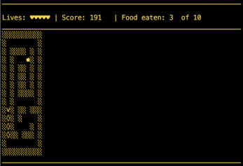
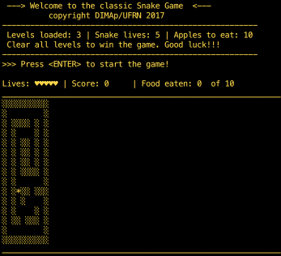

# LP1 Projeto 3 - Snaze

### Sumário
1. [Introdução](#1-introdução)
2. [Background](#2-background)
3. [Entradas](#3-entradas)
4. [Interface](#4-interface)
5. [Modelagem do Problema](#5-modelagem-do-problema)
6. [Dados para testes](#6-dados-para-testes)
7. [Método de Testes](#7-método-de-testes)


# 1.Introdução 

Neste projeto sua tarefa é desenvolver uma **simulação** do jogo clássico [Snake arcade video game](https://en.wikipedia.org/wiki/Snake_(video_game)) 
com uma diferença: a cobra está presa dentro de um labirinto!

A simulação do jogo **Snaze** carrega o nível do labirinto a partir de um arquivo texto de entrada, cujo nome é fornecido via argumento de linha de comando, e controla os movimentos da cobra. O desafio principal neste projeto de programação é projetar um motor básico de **inteligência artificial** (IA) que guia a cobra até a comida que surge em posições aleatórias dentro do labirinto sem que a cobra colida com as paredes do mesmo ou consigo mesma.

Para completar a tarefa você deve dominar suas habilidades de resolução de problemas e modelagem de sistemas, bem como desvendar as melhores estruturas de dados para implementar o projeto de forma eficiente. Você pode precisar utilizar contêineres do tipo sequência (e.g. vector), e contêineres associativos (e.g. map).

A Figura 1 mostra a tela inicial para o jogo **Snaze**, e a Figura 2 mostra a representação textual de um nível do jogo sendo jogado, no qual é possível identificar a comida (uma maçã), e a cobra movendo-se na direção norte.

|   |  |
|:---:|:---|
| <p align="center"> Figura 1 </p> | <p align="center">Figura 2</p> |


## Sobre o Jogo

As regras do jogo são:
1. A cobra tem *5* vidas
2. A cobra se move estendendo sua cabeça *1* passo na direção em que está se movendo e puxando toda sua cauda
3. Se a cobra comer a comida, seu comprimento aumenta em uma unidade e uma nova comida é colocada aleatoriamente em um local válido
4. Pode haver um ou mais níveis, dependendo do arquivo de entrada (cada entrada do arquivo com valores válidos de altura, largura e número de comidas descreve um novo nível)
    1. Quando todas as comidas de um nível acabam, a simulação carrega o próximo nível, os pontos são mantidos, a cobra reinicia seu tamanho e recomeça a partir de uma nova posição incial (definida no nível carregado).
5. Cada vez que a cobra se choca contra si mesma ou contra uma parede, ela perde uma vida; A cobra **perde** a simulação do jogo quando todas as *5* vidas são gastas. Quando a cobra perde uma vida, reinicie a simulação do nível, reiniciando a quantidade de comidas disponíveis, o score e o tamanho da cobra.
6. **Pense** em uma forma de calcular o score com base na quantidade de passos que a cobra deu para chegar na comida.
7. A cobra **ganha** a simulação do jogo se comer todos a comida disponível em todos os níveis.
    1. Após ganhar a simulação o programa finaliza.

## O Problema

Para cada iteração de simulação, o programa sempre fará o seguinte:

1. Decide se a cobra mantém a **direção atual** ou vira para a esquerda ou para a direita para uma **nova direção**
2. Move a cobra um passo na direção escolhida na Etapa *1*

Para controlar a cobra, a simulação deve fornecer a decisão exigida na Etapa *1*. Portanto, o processo de tomada de decisão que acontece na Etapa *1* está no centro da simulação do jogo.

Neste projeto de programação você deve encontrar **qualquer sequência de direções** que conduza a cobra com segurança à comida, caso tal sequência existir. Uma solução válida sempre fará com que a cobra atinja o seu alimento.

Caso o seu motor de IA não encontre uma solução válida, sua simulação deve produzir um controle aleatório que irá, inevitavelmente, provocar a colisão da cobra.

Por controle aleatório entende-se que o motor de IA define uma direção de movimento qualquer para a cobra que não cause colisão. Caso essa opção não exista, o motor de IA apenas mantém a direção (fatal) da cobra.

Seu programa deve receber um argumento via linha de comando com o nome de um arquivo que contém a informação sobre a configuração dos níveis de jogo. A saída do programa deve ser a animação (i.e. uma sequência de telas) da cobra movimentando-se de acordo com o motor de IA.

## Entrada

A entrada para a simulação do jogo **Snaze** será sempre um arquivo. A primeira linha do arquivo deve conter 3 inteiros positivos não-nulos: o número de linhas e o número de colunas do "grid" do labirinto daquele nível; seguido pela quantidade de vezes que as comidas serão geradas naquele mapa. Esses valores serão separados por um ou mais espaços em branco. Se algum desses valores for menor ou igual a zero, o programa deve encerrar com uma mensagem de erro. Um nível será sempre representado por um grid retangular.

As próximas linhas do arquivo contém os dados que configuram o nível. Um nível é composto por um conjunto de caracteres que têm o seguinte significado:

1. **'#'**: representa a **parede do labirinto**.
2. **>,v,\< ou ^**: indica a **posição do labirinto na qual a cobra é gerada**, incluindo sua **orientação inicial** esquerda(\>), direita(\<), cima(v), baixo(^), respectivamente.
3. **'.'** : representa uma **parede invisível**.

Cada nível deve conter uma única posição do labirinto na qual a cobra é gerada. Se um nível não possui esta indicação, sua simulação deve ignorar aquele nível. A parede invisível é útil para criar níveis com paredes não-retangulares. Uma localização marcada como *invisível* não pode ser alcançada pela cobra e também não pode conter comida.

Note que um arquivo de entrada deve ter uma sequência de um ou mais níveis, cada um deles obedecendo ao formato descrito anteriormente. Veja abaixo no Exemplo 1, um possível arquivo de entrada com dois níveis. O primeiro nível deste exemplo é representado abaixo:

```
15 10 5 
##########
#        #
# #### # #
# #    # #
# # ## # #
# # ## # #
# # ## # #
# # #### #
# #      #
# #v## ###
# # #    #
# #    # #
# ## ### #
#        #
##########
15 22 5
#####............#####
#   #............#   #
#   ##############   #
#                    #
#     ##### ######   #
#     ##### ##       #
#  v  ##### ## ###   #
#     ##### ## ###   #
#     #####    ###   #
#     ############   #
####       #         #
....#      #    ###  #
.....#         ###   #
......#####    #     #
...........###########
```
<p align="center"> Exemplo 1. Arquivo de entrada </p>

## Saída

Sua simulação deve produzir uma sequência de representação de nível (como na Figura 1), mostrando a localização da cobra dentro do labirinto, bem como as paredes e a comida. Isso é feito para cada iteração de simulação. Observe que a tela também deve exibir o status do jogo, como, por exemplo, o número de vidas da cobra, a pontuação, e o número de comidas que ainda faltam para o fim do nível atual do jogo.

Cada vez que a cobra se choca com algo, sua simulação deve imprimir uma mensagem adequada e perguntar se o usuário quer continuar ou não. Um nível é completado quando a quantidade de comida chega a 0 e a cobra come a última comida que foi colocada no mapa. Quando isso acontece, a simulação deve exibir uma mensagem correspondente e perguntar ao usuário se ele quer ir para o próximo nível (se houver), reiniciar aquele mesmo nível ou reiniciar do nível 1.

Caso a vida da cobra acabe, a simulação deve exibir uma mensagem e encerrar a simulação. Da mesma forma, se a cobra passar por todos os níveis, a simulação deve exibir uma mensagem de avisando que não existem mais níveis e também encerrar a simulação. Ao encerrar a simulação, o programa deve sempre perguntar ao usuário se ele quer reiniciar a simulação ou se quer encerrar o programa.

## Implementação

O próximo passo em direção a uma solução de programação, após entender claramente o problema, como as suas especificações de entrada e saída, é modelar as entidades de simulação do **Snaze**.

Logo abaixo pode-se verificar uma lista de classes que podem ser úteis para modelar o problema:

1. `Snake`: representa a cobra e seus atributos. A simulação do jogo deve possuir apenas uma cobra.
2. `Level`: representa um nível do jogo. Possui dimensões e personagens que representam elementos do jogo. A simulação do jogo pode ter um ou mais níveis.
3. `Player`: representa o motor de IA. Esta classe deve armazenar uma sequência de direções para alimentar a simulação. A sugestão é criar pelo menos dois métodos:
    1. `bool find_solution(...)`: dada a localização atual da cobra dentro do labirinto e a localização da comida, ele retorna `true` se ele encontrou (e armazenou) uma sequência de direções que leva à comida, ou `false` caso contrário. No caso da solução ser encontrada, este método também armazena a solução internamente no objeto.
    2. `int next_move(...)`: retorna uma direção para a cobra com base na sequência de direções encontradas e armazenadas pelo motor de IA ou em uma política aleatória (conforme descrito na Seção~\ref{sec:problem}).
4. `SnakeGame`: a entidade principal que instancia todos os outros objetos e gerencia a execução do jogo. Esta classe deve fornecer métodos, tais como `initialize_game()`, `update()`, `process_events()`, `render()`, `game_over()`, que são chamados no *loop* do jogo. Um bom template para organização da arquitetura do jogo é [Game Loop Pattern](http://gameprogrammingpatterns.com/game-loop.html), porém fique à vontade para escolher o modelo que funcione melhor.

## Algoritmo Backtracking

Para construir a solução da simulação do jogo é recomendado usar a estratégia *backtracking*, que pode ser descrita **recursivamente** como mostrado à seguir:

Seja M uma matriz retangular, e sejam as seguintes funções:
- `visitado(M,x,y)` uma função que retorna `true` se a posição `x,y` foi visitada ou não.
- `permitido(M,x,y)` retorna `true` se a cobra pode se mover para a posição `x,y`, `false` caso contrário.
- `encontrou(M,x,y)` retorna `true` se a cobra encontrou a comida na posição `x,y`, `false` caso contrário.

A função que encontra uma solução pode ser definida recursivamente da seguinte maneira:

```python
def find_solution(M,x,y):
    if encontrou(M,x,y):
        return True
    else
        if permitido(M,x+1,y) and not visitado(M,x+1,y):
            #escolheu "virar/continuar" pra direita
            if find_solution(M,x+1,y):
                return True
        if permitido(M,x-1,y) and not visitado(M,x-1,y):
            #escolheu "virar/continuar" pra esquerda
            if find_solution(M,x-1,y):
                return True
        if permitido(M,x,y+1) and not visitado(M,x,y+1):
            #escolheu "virar/continuar" pra baixo
            if find_solution(M,x,y+1):
                return True
        if permitido(M,x,y-1) and not visitado(M,x,y-1):
            #escolheu "virar/continuar" pra cima
            if find_solution(M,x,y-1):
                return True
    return False
```

Veja que a solução apresentada à cima, testa algum caminho e retorna `true` ao encontrar a primeira possibilidade de caminho. Não quer dizer que seja o melhor, pior ou médio, mas sim que existe um caminho da posição inicial `x,y` até a comida na matriz M. Nos resta apenas implementar as funções permitido, visitado e encontrou =).

O algoritmo recurisvo à cima é uma solução _bread'n butter_ (feijão com arroz) para _a busca em profundidade_ em uma matriz 2D com restrições, por ser recursivo, dependendo como as passagens de parâmetro são feitas (sem usar referencias), o fato de serem matrizes nas chamadas podem levar a um stack overflow dependendo do tamanho do labirinto e da posição da solução. Para tentar sobrepor esse problema, podemos implementar uma versão iterativa deste algoritmo seguindo, de forma geral o outro algoritmo abaixo:

1. A partir da posição atual da cobra, armazenar em um contêiner todas as possíveis localizações que a cobra poderá ocupar com um único passo e sem colidir com a parede ou consigo própria.
2. remover uma posição do contêiner, checar se a posição removida é a solução (i.e. a comida); se não for a solução,
    1. encontrar uma forma (uma estrutura de dados?) para monitorar as posições que já foram testadas, com o objetivo de ajudar o motor de IA a evitar (testar) esta posição no futuro, e;
    2. guardar no contêiner todas as novas posições possíveis ainda não testadas que a cobra pode atingir a partir daquela localização.
3. Continuar este procedimento até que o motor de IA encontre a comida ou até que o contêiner fique vazio, neste caso entende-se que não há solução para a configuração cobra-comida atual.


Ao usar os qualquer um dos dois algoritmos, não se esqueça de usar uma estrutura de dados para armazenar **a sequência de decisões** que levam à localização que está sendo testada no Passo *2* (ou nos locais comentados no caso do algoritmo recursivo). No entanto, lembre-se também que sempre que encontrar uma situação sem solução (`dead end`), você deve ignorar as direções que levam àquele dead end e retomar a busca por uma direção ainda não testada.

## Pacmaze: uma versão mais simples do problema

Uma versão inicial e muito boa para iniciar os trabalhos neste problema é o **Pacmaze**. O Pacmaze é uma versão do Snaze em que algumas restrições são removidas:
1. O pacman pode decidir virar para qualquer direção, diferente do snaze, onde a direção da "cauda" da cobrinha é bloqueada.
2. O pacman não tem modificação no seu "corpo" ao executar, facilitando a execução dos algoritmos de backtracking mostrados na seção [Algoritmo Backtracking](#algoritmo-backtracking).

O restante da implementação do **Pacmaze** é igual a implementação do **Snaze**, a interface e entradas são iguais o modelo de IA e algoritmos utilizados são os mesmos. No entando, o relaxamento das restriçoes à cima irão permitir implementações mais simples e mais fáceis de debugar.

Uma consideração interessante sobre o pacmaze é que devido às regras do jogo o pacmaze nunca morre. Não existe, pela especificação, forma de perder o jogo neste modo, assim mesmo a IA simples que toma decisões que não fazem o Pacman se chocar com a parede, sem levar em conta a posição da comida, irão permitir que o jogo execute do inicio ao fim sem game over.

**Sugestão:** Usando essa versão do problema você pode debugar o backtracking para verificar se o caminho encontrado leva até a comida, para fazer isso ao processar o caminho que leva até a comida, imprima no mapa as decisões tomadas dado que o Pacman chega naquela posição como no Exemplo 2 abaixo.

```
#####............#####
#   #............#   #
#   ##############   #
#  🡒🡒🡒🡒🡒🡒🡒🡒🡒🡒c #
#  🡑  ##### ######   #
#  🡑  ##### ##       #
#  v  ##### ## ###   #
#     ##### ## ###   #
#     #####    ###   #
#     ############   #
####       #         #
....#      #    ###  #
.....#         ###   #
......#####    #     #
...........###########
```
<p align="center"> Exemplo 2. Pacmaze mostrando as decisões que irão ser tomadas antes de iniciar o deselocamento até a comida 'c'.</p>

Veja que a decisão mostra a direção que a AI calculou dada a posição atual do pacman e a poisção da comida. Esse conjunto de decisão ilustrado é calculado logo após o pacman iniciar o jogo, dada sua posição inicial ou após ele consumir a comida 'c'. 

Isso quer dizer que o pacman já decidiu o caminho antes de começar a fazê-lo e não durante, essa observação é importante para que você entenda como a AI proposta neste trabalho deve funcionar. Como não temos elementos outros elementos que se movem no mapa, podemos pré calcular um conjunto de decisões que resolve o problema ao invés de *calcular à cada frame* como seria feito se fosse o jogo do pacman convencional (pois os fantasmas se movem).

## Os problemas da Cauda - 1

O **Pacmaze** é um importante passo para a solução do problema, mas quando consideramos o verdadeiro **Snaze** temos que lidar com o único, e talvez mais perigoso, inimigo da Snake no mapa, sua própria cauda.

Considere o cenário ilustrado abaixo no Exemplo 3, no qual tem-se uma cobra com corpo de tamanho igual a *3*, ou seja, uma cabeça e 2 partes de corpo. A direção de movimento atual é 'cima'. A comida é posicionada na posição *(4,3)*, marcado pela letra **F**. Presuma que todo o labirinto é cercado por paredes invisíveis. A IA precisa então decidir quais decições precisam ser tomadas para levar da posição atual até a comida.

```
    0   1   2   3
  +---+---+---+---+
0 |   |   |   |###|
  +---+---+---+---+
1 | V |###|   |###|
  +---+---+---+---+
2 | o | o |   |###|
  +---+---+---+---+
3 |###|   |###|###|
  +---+---+---+---+
4 |   |   |   | F |
  +---+---+---+---+

  V - Cabeça da cobra em direção norte.
  o - Corpo da cobra.
  F - Comida.
  # - Parede.
```
<p align="center"> Exemplo 3. O problema da cauda </p>

Observe que diferente do **Pacmaze** a Snake neste caso não pode tomar decisões que fazem ela se chocar com a própria Cauda, por exemplo iniciar decidindo ir para 'baixo'. Assim, aidiconando apenas esta restrição ao que já fizemos no **Pacmaze**, uma abordagem *ingênua* que resolve o problema, onde a IA leva em conta se apenas o movimento da cabeça da cobra ao longo do labirinto, apontaria como possível solução as posições $\langle (0,0), (0,1), (0,2), (1,2), (2,2)\rangle$. Entretanto, durante sua execução, o algoritmo backtracking inspeciona a posição $(2,1)$, que é atualmente ocupada pela cauda da cobra.

De acordo com o algoritmo, a cobra atingiu um ponto final. Isto significa que este caminho não leva à comida, portanto, todo o caminho deve ser descartado e marcado como visitado mas não integrante da solução. Certo? #nope.

Em um cenário real, o corpo da cobra deve estar junto da cabeça, a menos que a cobra tenha sido decapitada! Em uma simulação correta, ao chegar com a cabeça na posição $(2,2)$ a IA deveria identificar que o estado do labirinto está como mostra o Exemplo 4, abaixo:

```
    0   1   2   3
  +---+---+---+---+
0 |   |   | o |###|
  +---+---+---+---+
1 |   |###| o |###|
  +---+---+---+---+
2 |   |   | > |###|
  +---+---+---+---+
3 |###|   |###|###|
  +---+---+---+---+
4 |   |   |   | F |
  +---+---+---+---+

  V - Cabeça da cobra em direção oeste.
  o - Corpo da cobra.
  F - Comida.
  # - Parede.
```
<p align="center"> Exemplo 4. Cenário que deveria ser levado em consideração pela IA ao realizar os passos que levam às posições ((0,0), (0,1), (0,2), (1,2), (2,2)) </p>

Como pode ser visto, cobra tem um caminho claro até a comida! Portanto, os algoritmos devem, adicionalmente, armazenar no contêiner as posições $\langle (2,1), (3,1),(4,1), (4,2), (4,3)\rangle$ e, desta forma, alcançando a solução.

Considerando a situação acima descrita, os problemas que você deve resolver são:

1. *Como monitorar as posições que já foram visitadas pela cobra?* No segundo cenário, o algoritmo não deve considerar visitar a posição $(2,0)$ dado que isto levaria a uma solução na qual a cobra moveria-se em circulo eternamente. Além disso, a posição $(2,0)$ já foi testada (i.e. ocupada pela cobra).
2. *Como fazer com que o corpo da cobra siga junto da cabeça durante a busca por uma solução* O algoritmo deve garantir que o corpo "fantasma" da cobra não bloqueie posições potencialmente inexploradas que podem ser parte da solução.

**Nota:** A transição do **Pacmaze** para o **Snaze** é suave se você iniciar resolvendo o primeiro sem obrigatoriamente pensar no segundo. Tente sempre pensar sobre o que eu preciso modificar nos algoritmos usados no **Pacmaze** para resolver os novos problemas.

## O problemas da Cauda - 2

Ter cauda é realmente um problema, observe o Exemplo 5 abaixo:

```
    0   1   2   3
  +---+---+---+---+
0 |   |   |   |###|
  +---+---+---+---+
1 |   |###|   |###|
  +---+---+---+---+
2 |   |   |   |###|
  +---+---+---+---+
3 |###| v |###|###|
  +---+---+---+---+
4 |   | o | o | F |
  +---+---+---+---+

  V - Cabeça da cobra em direção oeste.
  o - Corpo da cobra.
  F - Comida.
  # - Parede.
```
<p align="center"> Exemplo 5. Problema dos ciclos </p>

Veja que neste caso a comida está "atrás" da cobra, o algoritmo "convencional" mostrado no decorrer deste documento iria testar as posições $\langle(2,1), (2,0), (1,0), (0,0), (0,1), (0,3), (1,2), (2,2)\rangle$ e ver que chegou em uma posição "já visitada" $(2,1)$. De forma recursiva (ou iterativa), o algoritmo irá realizar o bactracking e testar o outro caminho possível $\langle(2,1), (2,2), ..., (2,0)\rangle$, apenas para encontrar outra posição "já visitada" $(2,1)$. Dessa forma, ambos os algoritmos irão retornar decidir que "não existe caminho válido".

No entanto, este não é o caso, tanto o caminho inciando com $\langle(2,1), (2,0)...\rangle$ quanto aquele que inicia com $\langle(2,1), (2,2), ...\rangle$ permitem a Snake chegar à comida, para verificar isso é só fazermos a simulação dos movimentos para ver que quando a cabeça chega em $(2,1)$, _pela segunda vez_, ela apenas precisa virar para baixo seguindo pelo caminho "de volta" e chegará na solução. Observe que este não seria um problema no **Pacmaze** uma vez que o Pacman poderia apenas dar meia volta e ir na direção da comida.

**Veja que não é apenas uma questão de ignorar os lugares já visitados**, uma vez que guardar as posições visitadas está intrinsecamente relacionado com a condição de parada dos algoritmos. Desta forma, se você não levar em consideração que a posição $(2,1)$ já foi visitada anteriormente, ambos os algoritmos **poderão executar indefinidamente**, uma vez que a partir desta posição existirão duas possibilidades que já foram visitadas.

Considerando a situação acima descrita, o *outros* problema que você deve resolver é:

1. *Como monitorar as posições que já foram visitadas pela cobra, de forma a poder lidar com ciclos no mapa?* Em ambos os caminhos listados, a posição $(2,1)$ já foi visitada, mas levará à solução, no entanto, existe alguma diferença entre a primeira e segunda vez?
2. *Após resolvido o problema 1, como será a nova condição de parada dos algoritmos?* Após resolver a primeira parte, você poderá se pergunta rsobre como os algoritmos de achar caminho vão funcionar, é preciso mudar alguma coisa neles?

**Nota:** Este é um dos problemas mais dificeis relacionado à este trabalho que você precisa resolver para obter a nota máxima!

## Interface

O programa deve ser chamado *snaze*, e deve receber o arquivo de entrada por meio de argumentos de linha de comando. Veja abaixo um exemplo da interface do programa:

```
$ ./snaze
Usage: ./snaze <level_file> -mode [snaze|pacmaze] -ia [random|find]
  onde <level_file> é um arquivo txt contendo a descrição dos níveis no formato especificado neste documento
       -mode [snaze|pacmaze] representa o modo do jogo, sendo possíveis dois valores snaze ou pacmaze
       -ia [random|find] representa o modo da ia do jogo, sendo possível: "random" onde a classe player apenas escolhe decisões aleatorias, possívelmente não letais para a Snake/Pacman; ou "find" onde a classe player decide um caminho possível para a comida.
       -d por fim o programa pode receber o argumento -d, que sinaliza à interface para exibir as decisões calculadas pela classe player. Esse argumento é opcional.
```

Ao receber os argumentos o programa deve executar automaticamente indo para a tela inicial, que mostra o mapa atualmente carregado, a quantidade de vidas e uma mensagem pedindo para o usário pressionar alguma tecla para iniciar.

Após pressionada uma tecla o programa inicia com a simulação até que ocorra um gameover ou que o nível atual termine. Dos quais podem ocorrer:
- Se ocorreu um gameover, o programa deve pergutnar se o usuário quer recomeçar o mesmo mapa, reinicar do nível 1 ou sair do jogo. O usuário escolhe e a simulação continua (ou encerra).
- Se o nível atual terminou (porquê acabaram as comidas), o programa deve pergutnar se o usuário quer recomeçar o mesmo mapa, passar para o próximo nível ou sair do jogo. O usuário escolhe e a simulação continua (ou encerra).

Ao terminar o último mapa, o jogo deve considerar que ocorreu um game over, por isso as perguntas são as mesmas relativas ao game over.